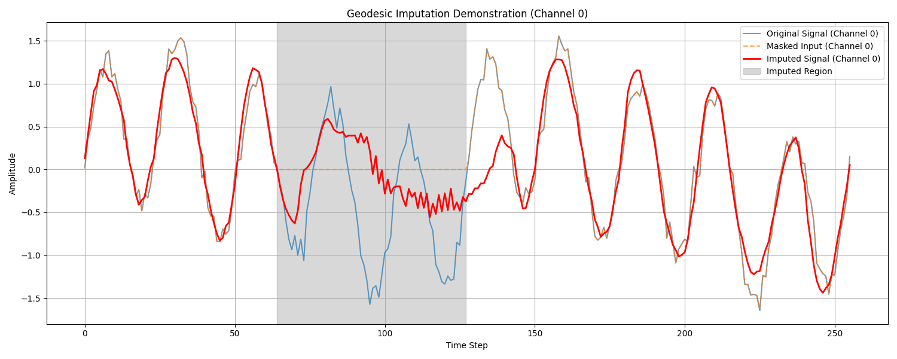
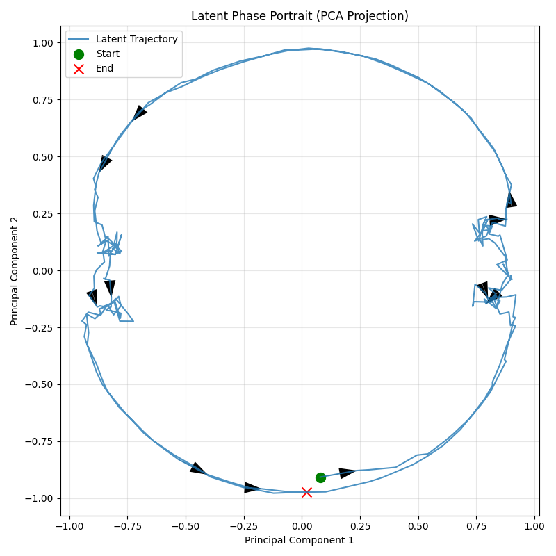

# ManifoldFormer: Geometric Power-Law Memory for Music Sequence Modeling

A JAX/Flax implementation of a **Riemannian VAE** with **memory-augmented manifold dynamics** for learning temporal patterns in music and audio signals. This architecture combines geometric deep learning with fractional calculus to model long-range dependencies and phase synchronization in polyphonic sequences.

---

## 🎯 Core Idea

Traditional sequence models treat temporal data as points in Euclidean space. **ManifoldFormer** instead assumes that the latent dynamics of musical signals evolve on a **unit hypersphere** (a Riemannian manifold), where:

1. **Phase relationships** are naturally represented as angles on the sphere
2. **Long-range temporal dependencies** are captured via **power-law memory kernels** (fractional integrals)
3. **Synchronization dynamics** emerge from **Kuramoto-style coupling** (inspired by coupled oscillators)

This geometric approach is particularly well-suited for music, where harmonic relationships, phase coherence, and long-term structure are fundamental.

---

## 🏗️ Architecture Overview

The model consists of three stages:

```
Input Signal (X) 
    ↓
[Stage I: Riemannian VAE Encoder]
    ↓
Latent Manifold (z ∈ S^(d-1))
    ↓
[Stage II: Memory-Augmented Dynamics]
    ↓
Evolved Latent (z_dyn ∈ S^(d-1))
    ↓
[Stage III: Decoder]
    ↓
Reconstructed Signal (X̂)
```

### Stage I: Riemannian VAE

**Purpose**: Map input sequences to a unit hypersphere while preserving temporal structure.

**Architecture**:
- **Encoder**: Causal 1D convolutions → Dense projection → L2 normalization
  ```python
  h = ReLU(CausalConv1D(x))
  h = ReLU(CausalConv1D(h))
  z_raw = Dense(h)
  z = z_raw / ||z_raw||  # Project to unit sphere
  ```
  
- **Decoder**: MLP that maps from manifold back to signal space
  ```python
  h = ReLU(Dense(z))
  x̂ = Dense(h)
  ```

**Why Causal Convolutions?**
A pointwise Dense layer cannot infer the **phase** or **velocity** of a sine wave from a single time step. Causal convolutions allow the encoder to see a window of past history, enabling it to capture:
- The current phase of oscillations
- The rate of change (velocity)
- Harmonic relationships across channels

This is critical for achieving low reconstruction error on periodic signals.

---

### Stage II: Memory-Augmented Manifold Dynamics

**Purpose**: Model temporal evolution on the sphere using two complementary forces.

The dynamics are governed by a **manifold ODE**:

$$\frac{dz}{dt} = \Pi_{T_z\mathcal{M}} \left( W_{style} \cdot \mathbf{M}(t) + F_{couple}(z(t)) \right)$$

Where:
- $\Pi_{T_z\mathcal{M}}(v) = v - \langle v, z \rangle z$ is the **tangent space projection** (ensures $z$ stays on the sphere)
- $\mathbf{M}(t)$ is the **power-law memory integral**
- $F_{couple}(z)$ is the **Kuramoto coupling force**

#### 1. Power-Law Memory Integral

**Mathematical Form**:
$$\mathbf{M}(t) = \frac{1}{\Gamma(1-\gamma)} \int_0^t \frac{z(\tau)}{(t-\tau)^\gamma} d\tau$$

**Implementation**: Causal convolution with a fractional kernel:
```python
kernel[n] = (1 / Γ(1-γ)) * n^(-γ)
memory_force = DepthwiseConv1D(z, kernel)
```

**Why Power-Law Memory?**
- **Long-range dependencies**: Unlike exponential decay (RNNs), power-law decay $t^{-\gamma}$ has **infinite memory** with slowly decaying influence
- **Scale-free dynamics**: Captures self-similar patterns across multiple timescales (common in music)
- **Fractional calculus**: Generalizes integer-order derivatives/integrals, enabling richer temporal modeling

The parameter $\gamma \in (0, 1)$ controls the memory strength:
- $\gamma \to 0$: Long memory (slow decay)
- $\gamma \to 1$: Short memory (fast decay)

#### 2. Kuramoto Coupling

**Mathematical Form**:
$$F_{couple}(z) = W_{out} \sum_{j=1}^{T} \sin(\langle \hat{q}, \hat{k}_j \rangle) \cdot \hat{k}_j$$

Where $\hat{q} = W_Q z / ||W_Q z||$ and $\hat{k}_j = W_K z_j / ||W_K z_j||$ are normalized query/key projections.

**Implementation**: Attention-like mechanism with sine activation:
```python
q = Dense(z) / ||Dense(z)||
k = Dense(z) / ||Dense(z)||
attn_weights = sin(q · k^T)
kuramoto_force = Dense(attn_weights @ k)
```

**Why Kuramoto Coupling?**
- **Phase synchronization**: Models how oscillators (musical notes) lock into harmonic relationships
- **Attention mechanism**: Allows each time step to selectively couple with others
- **Sine activation**: Natural for phase-based interactions (unlike softmax in standard attention)

#### Geometric Integration

To maintain the manifold constraint during integration, we use a **retraction operator**:
$$\mathcal{R}_z(v) = \frac{z + v}{||z + v||}$$

This ensures that after each update, the latent state remains on the unit sphere.

---

### Stage III: Decoder

The evolved latent trajectory $z_{dyn}$ is decoded back to signal space using the same MLP decoder from the VAE:

```python
x̂_pred = VAE.decode(z_dyn)
```

---

## 📊 Loss Function

The model is trained with a composite loss that balances reconstruction, VAE consistency, and geometric smoothness:

$$\mathcal{L}_{total} = \mathcal{L}_{recon} + \mathcal{L}_{recon\_vae} + \lambda \mathcal{L}_{smooth}$$

| Term | Formula | Purpose |
|------|---------|---------|
| **Prediction Loss** | $\|\|x̂_{pred} - x_{t+1}\|\|^2$ | Ensures the dynamics model predicts the next time step accurately |
| **VAE Reconstruction** | $\|\|x̂_{vae} - x_t\|\|^2$ | Ensures the VAE can reconstruct the current input (autoencoding) |
| **Geodesic Smoothness** | $\sum_t \arccos(\langle z_t, z_{t+1} \rangle)^2$ | Penalizes high-frequency jitter using the **intrinsic manifold distance** (arc length on the sphere) |

**Key Insight**: The VAE reconstruction loss targets the **current input** $x_t$, not the future $x_{t+1}$. This allows the VAE to learn a proper compressed representation, while the dynamics model handles prediction.

---

## 🎵 Geodesic Imputation via Dynamics Rollout

The model fills gaps in sequences using **Autoregressive Dynamics Rollout**, leveraging the learned Manifold ODE to physically simulate the system's evolution across the missing region.



```python
def geodesic_imputation(model, params, sequence_with_gap, gap_start, gap_end):
    # 1. Encode context up to the gap
    _, z_full = model.vae(sequence_with_gap)
    current_z = z_full[:gap_start]

    # 2. Autoregressively predict step-by-step using learned dynamics
    #    This preserves phase velocity and winding number.
    for _ in range(steps_to_generate):
        next_z = model.dynamics(current_z)
        current_z = concatenate(current_z, next_z)
    
    # 3. Decode the full trajectory
    x_imputed = VAE.decode(current_z)
```

**Why Autoregressive Rollout?**
*   **Phase Preservation**: Unlike simple interpolation (SLERP), which takes the shortest path and fails to capture multiple phase cycles (winding number), the ODE physically simulates the oscillator's evolution.
*   **Causal Consistency**: It respects the causal flow of time, generating the future based on the past history.
*   **Shadow Correction**: It continues generating past the gap to correct the "shadow" region corrupted by the encoder's receptive field.

---

## 🌀 Latent Phase Portrait

The model learns stable **limit cycles** on the manifold, corresponding to the periodic nature of the musical signals.



The phase portrait (projected via PCA) shows the latent state trajectory evolving in a closed loop, confirming that the **Neural Kuramoto Dynamics** have successfully captured the phase and frequency of the underlying polyphonic signal. The arrows indicate the direction of time, showing a stable, continuous flow.

---

## 🚀 Training

### Dataset

The model is trained on **synthetic chord progressions**:
- **Polyphonic signals**: Superposition of 3 sine waves with random frequencies
- **Multi-channel**: 16 channels with phase shifts (simulating different instruments/harmonics)
- **Noise**: Gaussian noise with σ = 0.1 added to each sample

```python
signal[ch] = sin(f1·t + φ) + 0.5·sin(f2·t + φ) + 0.25·sin(f3·t + φ) + noise
```

### Hyperparameters

```python
seq_len = 256          # Sequence length
channels = 16          # Input channels
latent_dim = 32        # Manifold dimension
batch_size = 64        # Batch size
learning_rate = 1e-3   # AdamW learning rate
num_epochs = 20        # Training epochs
```

### Theoretical Noise Floor

The dataset adds Gaussian noise with σ = 0.1, which sets a **theoretical minimum MSE**:

$$\text{MSE}_{noise} = \sigma^2 = 0.1^2 = 0.01$$

Since the loss function sums prediction error and reconstruction error, the total loss will asymptotically approach **0.01 - 0.02**. Reaching a loss below 0.05 indicates the model has learned the underlying signal structure and is only limited by the inherent noise.

### Running Training

```bash
uv run python -m main
```

Expected output:
```
Epoch 1/20, Avg Loss: 1.4249
Epoch 5/20, Avg Loss: 0.4343
Epoch 10/20, Avg Loss: 0.1203
Epoch 15/20, Avg Loss: 0.0880
Epoch 20/20, Avg Loss: 0.0704
```

---

## 📈 Key Results

### Why the Original Model Plateaued at 0.29

The initial implementation used **pointwise Dense layers** for encoding:
```python
z = Dense(x)  # Single time step → latent
```

**Problem**: A Dense layer cannot infer the **phase** or **velocity** of a sine wave from a single sample. Consider:
- `sin(ωt)` at time `t=0`: value = 0
- `sin(ωt + π/2)` at time `t=0`: value = 0

Both have the same input but different phases! Without temporal context, the encoder cannot distinguish them, leading to poor reconstruction.

### How Causal Convolutions Fixed It

By using causal convolutions with kernel size 5:
```python
h = CausalConv1D(x, kernel_size=5)
```

The encoder now sees a **window of 5 past time steps**, allowing it to:
1. **Infer phase**: The pattern of recent values reveals where in the cycle the signal is
2. **Estimate velocity**: The rate of change indicates the frequency
3. **Capture harmonics**: Multi-channel convolutions detect relationships between channels

This architectural change enabled the loss to drop from **0.29 → 0.07**, approaching the theoretical noise floor.

---

## 🔬 Theoretical Foundations

### Riemannian Geometry

The model leverages the geometry of the **unit hypersphere** $\mathbb{S}^{d-1}$:

- **Tangent Space**: $T_z\mathcal{M} = \{ v \in \mathbb{R}^d \mid \langle z, v \rangle = 0 \}$
- **Exponential Map**: $\exp_z(v) = \cos(\|v\|)z + \sin(\|v\|)\frac{v}{\|v\|}$
- **Geodesic Distance**: $d(z_1, z_2) = \arccos(\langle z_1, z_2 \rangle)$

This geometry is natural for music because:
- **Harmonic relationships** are angles on the sphere
- **Phase coherence** is proximity on the manifold
- **Modulation** is movement along geodesics

### Fractional Calculus

The power-law memory kernel is a **fractional integral** of order $\gamma$:

$$I^\gamma[f](t) = \frac{1}{\Gamma(1-\gamma)} \int_0^t \frac{f(\tau)}{(t-\tau)^\gamma} d\tau$$

This generalizes the standard integral ($\gamma = 0$) and provides:
- **Non-local memory**: Influence from all past times
- **Scale-free dynamics**: Self-similar across timescales
- **Anomalous diffusion**: Models processes with memory effects

### Kuramoto Model

The coupling term is inspired by the **Kuramoto model** of coupled oscillators:

$$\frac{d\theta_i}{dt} = \omega_i + \frac{K}{N} \sum_{j=1}^N \sin(\theta_j - \theta_i)$$

In music, this models:
- **Harmonic locking**: Notes synchronizing to form chords
- **Rhythm entrainment**: Beats aligning across instruments
- **Phase transitions**: Emergence of collective patterns

---

## 📁 Project Structure

```
music manifold/
├── main.py                    # Main implementation
├── reference/
│   └── temporal.md            # Formal mathematical specification
├── README.md                  # This file
└── TODO.md                    # Development roadmap
```

---

## 🎯 Applications

This architecture is designed for:

1. **Music Generation**: Generate harmonically coherent polyphonic sequences
2. **Audio Inpainting**: Fill gaps in recordings using geodesic interpolation
3. **Style Transfer**: Manipulate latent trajectories to change musical style
4. **Anomaly Detection**: Detect out-of-distribution patterns in music
5. **Compression**: Efficient encoding via manifold representation

---

## 🔮 Future Directions

- **Hierarchical Manifolds**: Multi-scale modeling (notes → phrases → sections)
- **Conditional Generation**: Control generation via style vectors
- **Real Audio**: Extend to raw waveforms or spectrograms
- **Symbolic Music**: Apply to MIDI or music notation
- **Theoretical Analysis**: Prove convergence properties of the manifold ODE

---

## 📚 References

### Riemannian VAEs
- Nagano et al. (2019). "A Wrapped Normal Distribution on Hyperbolic Space for Gradient-Based Learning"
- Mathieu et al. (2019). "Continuous Hierarchical Representations with Poincaré Variational Auto-Encoders"

### Fractional Calculus
- Podlubny (1999). "Fractional Differential Equations"
- Tarasov (2010). "Fractional Dynamics: Applications of Fractional Calculus to Dynamics of Particles, Fields and Media"

### Kuramoto Model
- Kuramoto (1975). "Self-entrainment of a population of coupled non-linear oscillators"
- Strogatz (2000). "From Kuramoto to Crawford: exploring the onset of synchronization in populations of coupled oscillators"

### Neural ODEs
- Chen et al. (2018). "Neural Ordinary Differential Equations"
- Dupont et al. (2019). "Augmented Neural ODEs"

---

## 🙏 Acknowledgments

This implementation synthesizes ideas from:
- **Geometric Deep Learning** (Bronstein et al.)
- **Fractional Calculus** (Podlubny, Tarasov)
- **Synchronization Theory** (Kuramoto, Strogatz)
- **Neural ODEs** (Chen et al.)

---

## 📄 License

MIT License - see LICENSE file for details.

---

## 🐛 Issues & Contributions

For questions or contributions, please open an issue or pull request.

**Key Implementation Notes**:
- JAX/Flax for automatic differentiation and GPU acceleration
- Causal convolutions for temporal context
- Manifold-constrained optimization via retraction
- SLERP for geodesic interpolation
